# YOLO预测结果结构说明文档

## 目录
- [整体结构图](#整体结构图)
- [BaseTensor类](#basetensor类)
- [Results类](#results类)
- [Result类](#result类)
- [Boxes类](#boxes类)
- [Masks类](#masks类)
- [Keypoints类](#keypoints类)
- [Probs类](#probs类)
- [OBB类](#obb类)
- [使用示例](#使用示例)
- [最佳实践](#最佳实践)
- [注意事项](#注意事项)

## 整体结构图

```mermaid
graph TD
    A[Results容器] --> B[Result单图结果]
    
    %% Result属性
    B --> C1[原始图像<br>orig_img]
    B --> C2[图像路径<br>path]
    B --> C3[类别名称<br>names]
    B --> C4[图像尺寸<br>orig_shape]
    
    %% 主要对象
    B --> D[检测框<br>boxes]
    B --> E[掩码<br>masks]
    B --> F[概率<br>probs]
    B --> G[关键点<br>keypoints]
    B --> H[有向框<br>obb]
    
    %% boxes属性
    D --> D1[xyxy坐标]
    D --> D2[xywh坐标]
    D --> D3[置信度conf]
    D --> D4[类别cls]
    D --> D5[跟踪ID]
    D --> D6[标准化坐标<br>xyxyn/xywhn]
    
    %% masks属性
    E --> E1[xy点坐标]
    E --> E2[掩码数据]
    E --> E3[多边形表示]
    E --> E4[标准化坐标xyn]
    
    %% probs属性
    F --> F1[top1概率及类别]
    F --> F2[top5概率及类别]
    F --> F3[所有类别概率]
    
    %% keypoints属性
    G --> G1[xy坐标]
    G --> G2[置信度]
    G --> G3[可见性]
    G --> G4[标准化坐标xyn]
    
    %% obb属性
    H --> H1[xywhr格式]
    H --> H2[8点坐标]
    H --> H3[置信度conf]
    H --> H4[类别cls]
    
    %% Result方法
    B --> M1[plot可视化]
    B --> M2[save保存]
    B --> M3[show显示]
    B --> M4[tojson/to_*导出]
    
    %% 样式定义
    classDef container fill:#f9f,stroke:#333;
    classDef object fill:#bbf,stroke:#333;
    classDef property fill:#dfd,stroke:#333;
    classDef method fill:#fdd,stroke:#333;
    
    %% 应用样式
    class A,B container;
    class D,E,F,G,H object;
    class D1,D2,D3,D4,D5,D6,E1,E2,E3,E4,F1,F2,F3,G1,G2,G3,G4,H1,H2,H3,H4 property;
    class M1,M2,M3,M4 method;
```



## BaseTensor类

### 简介
BaseTensor是所有YOLO结果对象(Boxes, Masks, Keypoints等)的基类，提供基本的张量操作和设备处理功能。

### 深入理解
1. **为什么需要BaseTensor？**
   - **统一接口**: 为所有结果对象提供一致的数据处理方法
   - **设备管理**: 统一处理CPU/GPU数据转换
   - **类型转换**: 提供Tensor和NumPy数组之间的转换

2. **数据组织方式**
   - **data属性**: 存储原始预测数据
     * 对于Boxes类：存储[x1,y1,x2,y2,conf,cls]格式数据
     * 对于Masks类：存储二值化掩码数据
     * 对于Keypoints类：存储关键点坐标和置信度
   
   - **orig_shape属性**: 保存原始图像尺寸
     * 用于坐标归一化和还原
     * 在可视化时确保尺寸正确

3. **实际应用场景**
```python
# 场景1：模型在GPU上预测，但需要在CPU上后处理
results = model('image.jpg', device='cuda:0')
cpu_results = results[0].cpu()  # 所有数据转移到CPU

# 场景2：需要与OpenCV等库交互时转换为numpy
boxes_np = results[0].boxes.numpy()
cv2.rectangle(image, (boxes_np[0], boxes_np[1]), 
              (boxes_np[2], boxes_np[3]), (0,255,0), 2)

# 场景3：在不同设备间移动数据
results = results.to(device='cuda:1')  # 移动到其他GPU
```

4. **性能考虑**
   - 避免频繁的设备转换，会带来额外开销
   - 尽可能在同一设备上完成所有操作
   - 批量处理时，合理使用.to()方法节省内存

### 属性
| 属性 | 类型 | 说明 |
|------|------|------|
| data | Tensor \| ndarray | 预测数据(如边界框、掩码等) |
| orig_shape | Tuple[int, int] | 原始图像尺寸(高度,宽度) |

### 方法
| 方法 | 说明 |
|------|------|
| cpu() | 将数据转移到CPU内存 |
| numpy() | 转换为numpy数组 |
| cuda() | 将数据转移到GPU内存 |
| to() | 转换到指定设备和数据类型 |

## Results类

### 简介
Results是YOLO模型预测输出的顶层容器，管理和操作单个或多个Result对象。

### 深入理解
1. **Results类的设计理念**
   - **容器模式**: 采用类似列表的容器设计，可以存储多张图片的预测结果
   - **统一管理**: 将不同任务（检测、分割、关键点等）的结果统一管理
   - **便捷访问**: 提供直观的索引访问方式，如`results[0]`获取第一张图片结果

2. **结果组织结构**
```python
Results
├── ims          # 原始图像列表
├── results      # 各图片Result对象列表
├── speed        # 处理速度信息
│   ├── preprocess   # 预处理时间
│   ├── inference    # 推理时间
│   └── postprocess  # 后处理时间
└── names        # 类别名称字典

Result (单张图片结果)
├── boxes        # 检测框信息
├── masks        # 分割掩码信息
├── probs        # 分类概率信息
├── keypoints    # 关键点信息
└── obb         # 有向边界框信息
```

3. **常见应用场景**
```python
# 场景1：批量处理图片
results = model(['img1.jpg', 'img2.jpg', 'img3.jpg'])
for result in results:
    process_single_image(result)

# 场景2：视频处理
for results in model.track('video.mp4'):
    # results包含一帧的所有检测结果
    for result in results:
        track_objects(result)

# 场景3：多任务处理
results = model('image.jpg', task='detect')  # 目标检测
results = model('image.jpg', task='segment') # 实例分割
results = model('image.jpg', task='pose')    # 姿态估计
```

4. **性能优化技巧**
   - **批量处理**: 使用batch处理提高吞吐量
   ```python
   results = model(images, batch=16)  # 批量处理16张图片
   ```
   
   - **流式处理**: 处理视频时使用生成器减少内存占用
   ```python
   for results in model.stream('video.mp4', stream=True):
       process_frame(results)
   ```
   
   - **设备管理**: 根据任务需求选择适当的处理设备
   ```python
   # GPU推理，CPU后处理
   results = model('image.jpg', device=0)
   results_cpu = results.cpu()
   ```

5. **数据导出选择指南**
   - **JSON格式**: 适用于Web API和跨平台场景
   - **DataFrame**: 适用于数据分析和统计
   - **XML/CSV**: 适用于传统数据交换和存储
   ```python
   # 选择合适的导出格式
   result = results[0]
   if need_web_api:
       json_data = result.tojson()
   elif need_analysis:
       df = result.pandas()
   elif need_storage:
       result.save_txt('results.txt')
   ```

6. **注意事项和最佳实践**
   - 处理大量图片时及时释放内存
   - 使用适当的数据类型和设备
   - 合理设置batch_size平衡速度和内存
   - 注意检查结果的有效性

### 属性
| 属性 | 类型 | 说明 |
|------|------|------|
| ims | List[np.ndarray] | 原始图像列表 |
| results | List[Result] | Result对象列表 |
| names | dict | 类别名称字典 |
| orig_shape | Tuple[int, int] | 原始图像尺寸 |
| boxes | Boxes \| None | 检测框信息 |
| masks | Masks \| None | 分割掩码信息 |
| probs | Probs \| None | 分类概率信息 |
| keypoints | Keypoints \| None | 关键点信息 |
| obb | OBB \| None | 有向边界框信息 |
| speed | dict | 推理速度信息 |

### 方法
| 方法 | 说明 | 参数 |
|------|------|------|
| update() | 更新结果对象 | boxes, masks, probs等 |
| cpu() | 数据转CPU | - |
| cuda() | 数据转GPU | - |
| numpy() | 转换为numpy | - |
| to() | 转换设备/类型 | device, dtype |
| new() | 创建新的Results | - |
| plot() | 可视化结果 | conf, line_width等 |
| show() | 显示结果 | - |
| save() | 保存结果 | filename |
| tojson() | 转换为JSON | - |
| to_dict() | 转换为字典 | - |
| to_pandas() | 转换为DataFrame | - |

## Boxes类

### 简介
Boxes类管理检测框的所有相关信息，支持多种坐标格式和转换。

### 深入理解
1. **坐标系统详解**

   ```mermaid
   graph TB
    A[边界框坐标系统] --> B[绝对坐标]
    A --> C[标准化坐标]
    B --> D[xyxy格式<br>左上右下]
    B --> E[xywh格式<br>中心宽高]
    C --> F[xyxyn格式<br>标准化左上右下]
    C --> G[xywhn格式<br>标准化中心宽高]
   ```

   **各格式使用场景**:
   - **xyxy格式**: 
     * 适合直接绘制和可视化
     * 便于计算IoU
     * OpenCV等库接口常用

   - **xywh格式**:
     * 适合目标跟踪
     * 便于中心点计算
     * 数据增强友好

   - **标准化格式**:
     * 图像尺寸无关
     * 适合模型训练
     * 跨分辨率应用

2. **实际应用示例**
```python
# 1. 边界框可视化
boxes = result.boxes
for box in boxes.xyxy:
    x1, y1, x2, y2 = box.cpu().numpy()
    cv2.rectangle(image, (int(x1), int(y1)), 
                 (int(x2), int(y2)), (0,255,0), 2)

# 2. 目标跟踪场景
boxes = result.boxes
centers = boxes.xywh[:, :2]  # 获取目标中心点
tracker.update(centers)      # 更新跟踪器

# 3. 数据归一化
norm_boxes = boxes.xywhn     # 获取归一化的中心点表示
model_input = prepare_input(norm_boxes)  # 用于模型训练
```

3. **置信度解析**
```python
boxes = result.boxes
conf = boxes.conf      # 获取置信度
cls = boxes.cls       # 获取类别

# 组合置信度和类别
for conf_val, cls_id in zip(conf, cls):
    class_name = names[int(cls_id)]
    print(f"{class_name}: {conf_val:.2f}")

# 按置信度排序
conf_sorted, indices = conf.sort(descending=True)
boxes_sorted = boxes[indices]  # 获取排序后的框
```

4. **跟踪ID使用**
```python
# 跟踪ID的生命周期
for frame_results in model.track(video_path, persist=True):
    boxes = frame_results[0].boxes
    if boxes.id is not None:
        for box_id in boxes.id:
            # 记录ID的轨迹
            track_history.setdefault(int(box_id), []).append(
                (boxes.xyxy, boxes.conf))
```

5. **边界框操作技巧**

   a. **框的裁剪和缩放**:
   ```python
   # 确保框在图像范围内
   def clip_boxes(boxes, img_shape):
       boxes.xyxy[:, [0, 2]] = boxes.xyxy[:, [0, 2]].clamp(0, img_shape[1])
       boxes.xyxy[:, [1, 3]] = boxes.xyxy[:, [1, 3]].clamp(0, img_shape[0])
       return boxes
   ```

   b. **框的合并和分割**:
   ```python
   # 合并重叠框
   from torchvision.ops import nms
   keep = nms(boxes.xyxy, boxes.conf, iou_threshold=0.5)
   merged_boxes = boxes[keep]
   ```

   c. **面积过滤**:
   ```python
   # 过滤小目标
   def filter_small_boxes(boxes, min_area=100):
       areas = (boxes.xyxy[:, 2] - boxes.xyxy[:, 0]) * \
               (boxes.xyxy[:, 3] - boxes.xyxy[:, 1])
       return boxes[areas > min_area]
   ```

6. **性能优化建议**
   - 批量处理边界框操作
   - 避免频繁的坐标格式转换
   - 合理使用标准化坐标
   - GPU上进行框处理时注意内存使用

7. **常见问题解决**
   - 坐标越界处理
   - 空检测框处理
   - 重叠框处理
   - 跟踪ID丢失处理

### 属性
| 属性 | 类型 | 说明 | 形状 |
|------|------|------|------|
| xyxy | Tensor | 左上右下坐标 | (N, 4) |
| xywh | Tensor | 中心点宽高坐标 | (N, 4) |
| xyxyn | Tensor | 标准化左上右下坐标 | (N, 4) |
| xywhn | Tensor | 标准化中心点宽高坐标 | (N, 4) |
| conf | Tensor | 置信度 | (N, 1) |
| cls | Tensor | 类别索引 | (N, 1) |
| id | Tensor | 跟踪ID(如果有) | (N, 1) |

### 坐标系统
- **xyxy格式**: [x1, y1, x2, y2]
  - x1, y1: 左上角坐标
  - x2, y2: 右下角坐标
  ```python
  boxes.xyxy  # 获取xyxy格式
  ```

- **xywh格式**: [x, y, w, h]
  - x, y: 中心点坐标
  - w, h: 宽度和高度
  ```python
  boxes.xywh  # 获取xywh格式
  ```

- **标准化坐标**:
  ```python
  boxes.xyxyn  # 获取标准化xyxy(范围0-1)
  boxes.xywhn  # 获取标准化xywh(范围0-1)
  ```

## Masks类

### 简介
Masks类管理实例分割的掩码信息，支持像素级和标准化坐标。

### 深入理解
1. **掩码数据的本质**

   ```mermaid
   graph TD
    A[Masks掩码数据] --> B[二值掩码矩阵<br>data]
    A --> C[边界点表示<br>xy/xyn]
    B --> D[像素级表示<br>0或1值]
    B --> E[可视化基础]
    C --> F[轮廓表示]
    C --> G[多边形操作]
   ```

2. **掩码类型和应用**
```python
# 1. 二值掩码应用
masks = result.masks
binary_masks = masks.data  # shape: (N, H, W)

# 与原图融合
for mask in binary_masks:
    # 将掩码应用到原图
    masked_img = cv2.bitwise_and(
        image, 
        image, 
        mask=mask.cpu().numpy().astype(np.uint8)
    )

# 2. 轮廓提取和处理
contours = []
for mask in binary_masks:
    mask_np = mask.cpu().numpy().astype(np.uint8)
    # OpenCV轮廓提取
    cnts, _ = cv2.findContours(
        mask_np, 
        cv2.RETR_EXTERNAL, 
        cv2.CHAIN_APPROX_SIMPLE
    )
    contours.extend(cnts)
```

3. **实际应用场景**

   a. **图像分割和背景替换**:
   ```python
   # 替换背景
   def replace_background(image, masks, background):
       result = image.copy()
       for mask in masks.data:
           mask_np = mask.cpu().numpy().astype(np.uint8)
           # 创建反向掩码
           inv_mask = cv2.bitwise_not(mask_np)
           # 提取前景
           fg = cv2.bitwise_and(image, image, mask=mask_np)
           # 提取背景
           bg = cv2.bitwise_and(background, background, mask=inv_mask)
           # 合并结果
           result = cv2.add(fg, bg)
       return result
   ```

   b. **实例统计和分析**:
   ```python
   # 计算每个实例的面积
   def analyze_instances(masks):
       areas = []
       for mask in masks.data:
           # 计算掩码中1的数量
           area = mask.sum().item()
           areas.append(area)
       return areas
   ```

   c. **掩码后处理**:
   ```python
   # 掩码平滑和优化
   def smooth_masks(masks):
       smoothed = []
       for mask in masks.data:
           mask_np = mask.cpu().numpy().astype(np.uint8)
           # 形态学操作
           kernel = np.ones((3,3), np.uint8)
           smoothed_mask = cv2.morphologyEx(
               mask_np, 
               cv2.MORPH_CLOSE, 
               kernel
           )
           smoothed.append(smoothed_mask)
       return smoothed
   ```

4. **性能优化技巧**
   - 批量处理掩码操作
   - 使用向量化操作代替循环
   - GPU上处理大规模掩码数据
   ```python
   # 批量掩码处理
   def batch_process_masks(masks):
       # 将所有掩码堆叠处理
       stacked_masks = torch.stack(masks)
       # 批量形态学处理
       processed = torch.nn.functional.max_pool2d(
           stacked_masks.float(), 
           kernel_size=3, 
           stride=1, 
           padding=1
       )
       return processed
   ```

5. **常见问题和解决方案**
   - **掩码质量优化**:
     * 使用形态学操作改善边缘
     * 平滑处理减少噪声
     * 填充小孔洞

   - **内存管理**:
     * 及时释放大型掩码数据
     * 使用适当的数据类型
     * 考虑压缩存储方案

   - **精度与速度平衡**:
     * 根据需求选择合适的掩码分辨率
     * 权衡处理精度和计算开销
     * 考虑使用近似算法

6. **注意事项**
   - 确保掩码尺寸与原图匹配
   - 处理边界情况和无效掩码
   - 注意坐标系统的一致性
   - 处理掩码重叠情况

### 属性
| 属性 | 类型 | 说明 | 形状 |
|------|------|------|------|
| xy | List[ndarray] | 掩码边界点坐标 | [(P, 2), ...] |
| xyn | List[ndarray] | 标准化边界点坐标 | [(P, 2), ...] |
| data | Tensor | 二值掩码数据 | (N, H, W) |

### 掩码数据结构
```python
# 二值掩码
masks.data  # shape: (N, H, W), 值: 0或1

# 边界点坐标
masks.xy    # 每个掩码的边界点列表
masks.xyn   # 标准化的边界点列表
```

## Keypoints类

### 简介
Keypoints类管理关键点检测结果，支持坐标、置信度和可见性信息。

### 深入理解
1. **关键点检测基础**

   ```mermaid
   graph TD
    A[关键点检测] --> B[坐标表示]
    A --> C[置信度]
    A --> D[可见性]
    B --> E[绝对坐标xy]
    B --> F[标准化坐标xyn]
    C --> G[关键点置信度]
    D --> H[可见性状态<br>0:不可见<br>1:遮挡<br>2:可见]
   ```

2. **数据结构解析**
```python
# 关键点数据组织 shape:(N, K, 3)
keypoints.data  
# - N: 实例数量
# - K: 每个实例的关键点数量
# - 3: [x, y, conf/visibility]

# 坐标访问
xy = keypoints.xy     # 获取像素坐标
xyn = keypoints.xyn   # 获取标准化坐标
conf = keypoints.conf # 获取置信度
```

3. **实际应用场景**

   a. **人体姿态估计**:
   ```python
   # 提取人体骨架
   def extract_skeleton(keypoints):
       # 定义骨架连接
       skeleton_pairs = [
           (5, 7),  # 左上臂
           (7, 9),  # 左前臂
           (6, 8),  # 右上臂
           (8, 10), # 右前臂
           (11, 13),# 左大腿
           (13, 15),# 左小腿
           (12, 14),# 右大腿
           (14, 16) # 右小腿
       ]
       
       lines = []
       for kpts in keypoints.xy:
           for pair in skeleton_pairs:
               pt1 = kpts[pair[0]]
               pt2 = kpts[pair[1]]
               if keypoints.conf[pair[0]] > 0.5 and \
                  keypoints.conf[pair[1]] > 0.5:
                   lines.append([pt1, pt2])
       return lines
   ```

   b. **动作识别**:
   ```python
   # 计算关键点间角度
   def calculate_joint_angles(keypoints):
       angles = {}
       # 计算肘部角度
       left_elbow = calculate_angle(
           keypoints.xy[:, 5],  # 左肩
           keypoints.xy[:, 7],  # 左肘
           keypoints.xy[:, 9]   # 左腕
       )
       angles['left_elbow'] = left_elbow
       return angles
   ```

   c. **姿态跟踪**:
   ```python
   # 跟踪关键点运动
   def track_motion(keypoints_sequence):
       trajectories = {}
       for frame_idx, keypoints in enumerate(keypoints_sequence):
           for kpt_idx, kpt in enumerate(keypoints.xy):
               if kpt_idx not in trajectories:
                   trajectories[kpt_idx] = []
               trajectories[kpt_idx].append(kpt)
       return trajectories
   ```

4. **关键点后处理**

   a. **平滑处理**:
   ```python
   # 关键点平滑
   def smooth_keypoints(keypoints_sequence, window=5):
       smoothed = []
       for i in range(len(keypoints_sequence)):
           start = max(0, i - window // 2)
           end = min(len(keypoints_sequence), i + window // 2 + 1)
           window_kpts = keypoints_sequence[start:end]
           avg_kpts = torch.stack(window_kpts).mean(dim=0)
           smoothed.append(avg_kpts)
       return smoothed
   ```

   b. **插值补充**:
   ```python
   # 处理缺失关键点
   def interpolate_missing(keypoints):
       for i, conf in enumerate(keypoints.conf):
           if conf < 0.5:  # 置信度低，认为是缺失点
               # 寻找最近的有效点进行插值
               valid_points = keypoints.xy[keypoints.conf > 0.5]
               if len(valid_points) > 0:
                   nearest = find_nearest_valid(valid_points, keypoints.xy[i])
                   keypoints.xy[i] = nearest
       return keypoints
   ```

5. **优化建议**
   - 使用时间序列平滑提高稳定性
   - 考虑关键点间的物理约束
   - 结合运动预测提高跟踪效果
   - 处理遮挡和自遮挡情况

6. **常见问题解决**
   - **抖动处理**: 使用卡尔曼滤波
   - **遮挡恢复**: 基于时序信息预测
   - **误检处理**: 使用人体先验约束
   - **姿态异常**: 基于骨架结构验证

7. **性能优化**
   - 批量处理关键点数据
   - 使用向量化运算提高效率
   - GPU加速大规模计算
   - 合理设置关键点检测阈值

### 属性
| 属性 | 类型 | 说明 | 形状 |
|------|------|------|------|
| xy | Tensor | 关键点坐标 | (N, K, 2) |
| xyn | Tensor | 标准化坐标 | (N, K, 2) |
| conf | Tensor | 置信度 | (N, K) |
| data | Tensor | 原始数据 | (N, K, 3/4) |

### 关键点索引
对于人体姿态估计，关键点索引如下：
```python
KEYPOINT_INDICES = {
    0: "nose",
    1: "left_eye",
    2: "right_eye",
    3: "left_ear",
    4: "right_ear",
    5: "left_shoulder",
    6: "right_shoulder",
    7: "left_elbow",
    8: "right_elbow",
    9: "left_wrist",
    10: "right_wrist",
    11: "left_hip",
    12: "right_hip",
    13: "left_knee",
    14: "right_knee",
    15: "left_ankle",
    16: "right_ankle"
}
```

## OBB类

### 简介
OBB(Oriented Bounding Box)类管理有向边界框，支持旋转框的表示和操作。适用于旋转目标的检测和定位，如航空图像中的飞机、遥感图像中的舰船等。

### 深入理解
1. **有向边界框的概念**

   ```mermaid
   graph TD
    A[OBB表示方式] --> B[中心点表示<br>xywhr]
    A --> C[顶点表示<br>xyxyxyxy]
    B --> D[x,y: 中心坐标]
    B --> E[w,h: 宽高]
    B --> F[r: 旋转角度]
    C --> G[4个顶点<br>8个坐标]
    C --> H[顺时针/逆时针<br>排列]
   ```

2. **坐标系统转换**
```python
# 1. xywhr转8点坐标
def xywhr_to_xyxyxyxy(xywhr):
    x, y, w, h, r = xywhr
    # 计算旋转矩阵
    cos_r = torch.cos(r)
    sin_r = torch.sin(r)
    # 计算四个角点
    x_points = torch.tensor([-w/2, w/2, w/2, -w/2])
    y_points = torch.tensor([-h/2, -h/2, h/2, h/2])
    # 应用旋转
    rotated_x = x + x_points * cos_r - y_points * sin_r
    rotated_y = y + x_points * sin_r + y_points * cos_r
    # 组合结果
    return torch.stack([rotated_x, rotated_y], dim=1)

# 2. 8点坐标转xywhr
def xyxyxyxy_to_xywhr(points):
    # 计算中心点
    center = points.mean(dim=0)
    # 计算主方向
    vectors = points - center
    angles = torch.atan2(vectors[:, 1], vectors[:, 0])
    # 计算旋转角度
    rotation = angles.mean()
    # 计算宽高
    points_normalized = rotate_points(points - center, -rotation)
    w = points_normalized[:, 0].max() - points_normalized[:, 0].min()
    h = points_normalized[:, 1].max() - points_normalized[:, 1].min()
    return torch.tensor([center[0], center[1], w, h, rotation])
```

3. **实际应用场景**

   a. **航拍图像目标检测**:
   ```python
   # 计算飞机朝向
   def calculate_aircraft_orientation(obb):
       x, y, w, h, r = obb.xywhr[0]
       orientation = (r * 180 / math.pi) % 360
       return orientation

   # 提取停机坪区域
   def extract_parking_area(obb):
       points = obb.xyxyxyxy[0]
       # 扩展区域
       expanded = expand_polygon(points, scale=1.5)
       return expanded
   ```

   b. **文本检测**:
   ```python
   # 处理倾斜文本
   def process_text_orientation(obb):
       # 获取文本方向
       angle = obb.xywhr[0, 4]
       # 校正文本
       corrected = rotate_image(
           image, 
           -angle,
           center=(obb.xywhr[0, 0], obb.xywhr[0, 1])
       )
       return corrected
   ```

4. **性能优化技巧**
```python
# 1. 批量处理OBB
def batch_process_obb(obbs):
    # 批量旋转计算
    cos_r = torch.cos(obbs.xywhr[:, 4])
    sin_r = torch.sin(obbs.xywhr[:, 4])
    # 批量坐标变换
    centers = obbs.xywhr[:, :2]
    sizes = obbs.xywhr[:, 2:4]
    # 批量生成角点
    corners = generate_corners_batch(centers, sizes, cos_r, sin_r)
    return corners

# 2. GPU加速
def gpu_accelerated_obb(obb):
    if not obb.is_cuda:
        obb = obb.cuda()
    # GPU上进行坐标变换
    transformed = transform_on_gpu(obb)
    return transformed.cpu()
```

5. **常见问题解决**

   a. **角度归一化**:
   ```python
   def normalize_angle(angle):
       """将角度归一化到[-pi/2, pi/2]范围"""
       angle = angle % math.pi
       if angle > math.pi/2:
           angle -= math.pi
       return angle
   ```

   b. **边界处理**:
   ```python
   def clip_obb(obb, img_shape):
       """确保OBB不超出图像范围"""
       h, w = img_shape
       points = obb.xyxyxyxy
       points[:, 0::2] = points[:, 0::2].clamp(0, w)
       points[:, 1::2] = points[:, 1::2].clamp(0, h)
       return points_to_obb(points)
   ```

6. **注意事项**
   - 角度表示的一致性（弧度/角度）
   - 旋转方向的约定（顺时针/逆时针）
   - 边界情况的处理
   - 计算精度的控制

### 属性
| 属性 | 类型 | 说明 | 形状 |
|------|------|------|------|
| xywhr | Tensor | 中心点宽高旋转角 | (N, 5) |
| xyxyxyxy | Tensor | 8点坐标表示 | (N, 8) |
| conf | Tensor | 置信度 | (N, 1) |
| cls | Tensor | 类别索引 | (N, 1) |

### 坐标格式
```python
# xywhr格式: [x_center, y_center, width, height, rotation]
obb.xywhr

# 8点坐标: [x1,y1, x2,y2, x3,y3, x4,y4]
obb.xyxyxyxy
```

## Probs类

### 简介
Probs类管理分类预测的概率信息，提供方便的接口来访问和处理模型输出的类别概率。

### 深入理解
1. **概率数据结构**

   ```mermaid
   graph TD
    A[Probs概率数据] --> B[原始概率分布<br>data]
    A --> C[Top-K信息]
    B --> D[所有类别概率]
    C --> E[top1最高概率<br>及类别]
    C --> F[top5概率列表<br>及类别]
    D --> G[Softmax后概率]
    D --> H[原始Logits]
   ```

2. **概率处理方法**
```python
# 1. 获取最可能的类别
prob, cls_idx = probs.top1
class_name = names[int(cls_idx)]
confidence = float(prob)
prediction = f"{class_name}: {confidence:.2f}"

# 2. 多类别分析
top5_probs, top5_indices = probs.top5
for prob, idx in zip(top5_probs, top5_indices):
    class_name = names[int(idx)]
    print(f"{class_name}: {float(prob):.2f}")

# 3. 概率分布处理
all_probs = probs.data
# 应用温度缩放
temperature = 1.5
scaled_probs = torch.softmax(all_probs / temperature, dim=0)
```

3. **实际应用场景**

   a. **多标签分类**:
   ```python
   def get_multilabel_results(probs, threshold=0.5):
       """获取多标签预测结果"""
       labels = []
       scores = []
       for i, prob in enumerate(probs.data):
           if prob > threshold:
               labels.append(names[i])
               scores.append(float(prob))
       return labels, scores
   ```

   b. **置信度过滤**:
   ```python
   def filter_predictions(probs, min_conf=0.3):
       """过滤低置信度预测"""
       mask = probs.data > min_conf
       filtered_probs = probs.data[mask]
       filtered_classes = torch.nonzero(mask).squeeze()
       return filtered_probs, filtered_classes
   ```

   c. **类别平衡处理**:
   ```python
   def apply_class_weights(probs, class_weights):
       """应用类别权重"""
       weighted_probs = probs.data * torch.tensor(class_weights)
       return torch.softmax(weighted_probs, dim=0)
   ```

4. **性能优化技巧**
```python
# 1. 批量处理概率
def batch_process_probs(probs_list):
    # 堆叠概率张量
    stacked_probs = torch.stack([p.data for p in probs_list])
    # 批量计算
    batch_results = torch.softmax(stacked_probs, dim=1)
    return batch_results

# 2. 内存优化
def efficient_top_k(probs, k=5):
    # 使用torch.topk优化
    values, indices = torch.topk(probs.data, k)
    return values, indices
```

5. **集成预测**
```python
def ensemble_predictions(probs_list, weights=None):
    """集成多个模型的预测结果"""
    if weights is None:
        weights = [1.0] * len(probs_list)
    
    # 加权平均
    weighted_probs = torch.zeros_like(probs_list[0].data)
    for probs, weight in zip(probs_list, weights):
        weighted_probs += weight * probs.data
    
    return weighted_probs / sum(weights)
```

6. **常见问题解决**
   - **概率校准**:
     ```python
     def calibrate_probabilities(probs, temperature=1.0):
         """使用温度缩放校准概率"""
         logits = torch.log(probs.data)
         calibrated = torch.softmax(logits / temperature, dim=0)
         return calibrated
     ```
   
   - **处理类别不平衡**:
     ```python
     def handle_class_imbalance(probs, class_frequencies):
         """基于类别频率调整概率"""
         adjusted = probs.data / torch.tensor(class_frequencies)
         return torch.softmax(adjusted, dim=0)
     ```

7. **注意事项**
   - 保持概率和为1
   - 处理数值下溢问题
   - 合理设置概率阈值
   - 考虑类别分布偏差

### 属性
| 属性 | 类型 | 说明 |
|------|------|------|
| top1 | Tuple[float, int] | (最高概率, 类别索引) |
| top5 | Tuple[List, List] | (前5概率列表, 类别索引列表) |
| data | Tensor | 所有类别概率 |

### 使用示例
```python
# 获取top1预测
prob, cls_idx = probs.top1

# 获取top5预测
probs_list, indices = probs.top5

# 获取所有概率
all_probs = probs.data
```

## 使用示例

### 1. 基本检测与后处理

#### a. 标准检测流程
```python
from ultralytics import YOLO

# 加载模型
model = YOLO('yolov8n.pt')

# 执行检测
results = model('image.jpg')

# 处理第一张图片的结果
result = results[0]

# 获取基本信息
boxes = result.boxes
coords = boxes.xyxy    # 获取框坐标
confs = boxes.conf     # 获取置信度
classes = boxes.cls    # 获取类别
```

#### b. 结果可视化
```python
# 绘制检测框和标签
def visualize_detection(image, result, color_map=None):
    img = image.copy()
    for box, conf, cls in zip(result.boxes.xyxy, result.boxes.conf, result.boxes.cls):
        x1, y1, x2, y2 = box.int().cpu().numpy()
        class_name = result.names[int(cls)]
        score = float(conf)
        
        # 获取类别颜色
        color = color_map.get(class_name, (0, 255, 0))
        
        # 绘制边界框
        cv2.rectangle(img, (x1, y1), (x2, y2), color, 2)
        
        # 添加标签
        label = f"{class_name}: {score:.2f}"
        cv2.putText(img, label, (x1, y1 - 10),
                   cv2.FONT_HERSHEY_SIMPLEX, 0.5, color, 2)
    
    return img
```

#### c. 结果统计分析
```python
# 类别统计
def analyze_detection(result):
    stats = {}
    # 按类别统计
    for cls in result.boxes.cls:
        class_name = result.names[int(cls)]
        stats[class_name] = stats.get(class_name, 0) + 1
    
    # 计算平均置信度
    avg_conf = float(result.boxes.conf.mean())
    
    # 计算框面积分布
    areas = (result.boxes.xyxy[:, 2] - result.boxes.xyxy[:, 0]) * \
            (result.boxes.xyxy[:, 3] - result.boxes.xyxy[:, 1])
    area_stats = {
        'min': float(areas.min()),
        'max': float(areas.max()),
        'mean': float(areas.mean()),
        'median': float(areas.median())
    }
    
    return {
        'class_counts': stats,
        'total_objects': len(result.boxes),
        'average_confidence': avg_conf,
        'area_statistics': area_stats
    }
```

#### d. 自定义后处理
```python
# NMS后处理
def custom_nms(boxes, scores, iou_threshold=0.5):
    """自定义非极大值抑制"""
    keep = []
    order = scores.argsort(descending=True)
    
    while order.numel() > 0:
        if order.numel() == 1:
            keep.append(order.item())
            break
        i = order[0].item()
        keep.append(i)
        
        # 计算IoU
        ious = box_iou(boxes[order[1:]], boxes[i:i+1])
        mask = ious <= iou_threshold
        order = order[1:][mask]
    
    return keep
```
```python
from ultralytics import YOLO

# 加载模型
model = YOLO('yolov8n.pt')

# 执行检测
results = model('image.jpg')

# 处理第一张图片的结果
result = results[0]

# 获取检测框
boxes = result.boxes
coords = boxes.xyxy    # 获取框坐标
confs = boxes.conf     # 获取置信度
classes = boxes.cls    # 获取类别
```

### 2. 实例分割与场景分析

#### a. 交互式分割
```python
def interactive_segmentation(result, roi):
    """基于ROI的交互式分割"""
    # 获取掩码数据
    masks = result.masks.data
    
    # 计算与ROI的交集
    roi_mask = create_roi_mask(roi, masks.shape[1:])
    intersection = masks & roi_mask
    
    # 选择最大交集的实例
    areas = intersection.sum(dim=(1,2))
    best_instance = areas.argmax()
    
    return masks[best_instance]
```

#### b. 实例合并与分离
```python
def process_instances(masks):
    """处理重叠和相邻实例"""
    # 合并相近实例
    def merge_close_instances(mask1, mask2, distance_thresh=10):
        dist = calculate_mask_distance(mask1, mask2)
        return dist < distance_thresh
    
    # 分离重叠实例
    def split_overlapping_instances(mask):
        # 使用分水岭算法分离
        markers = get_instance_markers(mask)
        return watershed_split(mask, markers)
    
    processed_masks = []
    for i, mask in enumerate(masks):
        # 检查重叠
        if has_overlapping(mask, processed_masks):
            submasks = split_overlapping_instances(mask)
            processed_masks.extend(submasks)
        else:
            processed_masks.append(mask)
    
    return processed_masks
```

#### c. 区域分析
```python
def analyze_scene(result):
    """场景分析与统计"""
    masks = result.masks
    boxes = result.boxes
    
    # 计算实例统计
    stats = {
        'instance_count': len(masks),
        'average_size': calculate_average_size(masks),
        'density_map': create_density_map(masks),
        'spatial_distribution': analyze_spatial_distribution(boxes)
    }
    
    # 计算实例间关系
    adjacency_matrix = calculate_instance_adjacency(masks)
    stats['instance_relations'] = analyze_instance_relations(adjacency_matrix)
    
    return stats
```

#### d. 语义分析
```python
def semantic_scene_analysis(result):
    """场景语义理解"""
    # 获取实例信息
    instance_info = []
    for box, mask in zip(result.boxes, result.masks):
        instance = {
            'class': result.names[int(box.cls)],
            'confidence': float(box.conf),
            'area': float(mask.data.sum()),
            'position': get_relative_position(box),
        }
        instance_info.append(instance)
    
    # 分析场景布局
    layout = analyze_layout(instance_info)
    
    # 生成场景描述
    scene_description = generate_scene_description(layout)
    
    return {
        'instances': instance_info,
        'layout': layout,
        'description': scene_description
    }
```

### 3. 关键点检测与姿态分析

#### a. 高级姿态估计
```python
def analyze_pose(keypoints):
    """高级姿态分析"""
    # 1. 姿态分类
    def classify_pose(angles):
        poses = {
            'standing': lambda: is_standing(angles),
            'sitting': lambda: is_sitting(angles),
            'lying': lambda: is_lying(angles),
            'walking': lambda: is_walking(angles)
        }
        return max(poses.items(), key=lambda x: x[1]())[0]
    
    # 计算关键关节角度
    joint_angles = calculate_joint_angles(keypoints.xy)
    
    # 姿态分析结果
    analysis = {
        'pose_type': classify_pose(joint_angles),
        'joint_angles': joint_angles,
        'body_orientation': estimate_orientation(keypoints),
        'balance_score': calculate_balance_score(keypoints),
        'symmetry_score': analyze_body_symmetry(keypoints)
    }
    
    return analysis
```

#### b. 行为识别
```python
def recognize_action(keypoints_sequence, window_size=30):
    """基于关键点序列的行为识别"""
    # 1. 提取时序特征
    features = extract_motion_features(keypoints_sequence)
    
    # 2. 动作分类
    actions = {
        'walking': detect_walking_pattern(features),
        'running': detect_running_pattern(features),
        'jumping': detect_jumping_pattern(features),
        'waving': detect_waving_pattern(features)
    }
    
    # 3. 置信度计算
    confidences = calculate_action_confidence(features, actions)
    
    return {
        'primary_action': max(confidences.items(), key=lambda x: x[1])[0],
        'all_actions': confidences
    }
```

#### c. 交互分析
```python
def analyze_interaction(keypoints_group):
    """分析多人交互行为"""
    interactions = []
    
    # 计算人物间距离和朝向
    for i, kpts1 in enumerate(keypoints_group):
        for j, kpts2 in enumerate(keypoints_group[i+1:], i+1):
            interaction = {
                'distance': calculate_person_distance(kpts1, kpts2),
                'facing': analyze_facing_direction(kpts1, kpts2),
                'gesture': detect_interaction_gesture(kpts1, kpts2)
            }
            
            # 判断交互类型
            interaction['type'] = classify_interaction(interaction)
            interactions.append(interaction)
    
    return interactions
```

#### d. 异常检测
```python
def detect_abnormal_pose(keypoints, history=None):
    """检测异常姿态"""
    # 1. 关节角度约束检查
    joint_violations = check_joint_constraints(keypoints)
    
    # 2. 时序异常检测
    if history is not None:
        temporal_anomalies = detect_temporal_anomalies(
            keypoints, 
            history,
            window_size=10
        )
    
    # 3. 姿态平衡性检查
    balance_issues = check_balance_stability(keypoints)
    
    # 4. 综合评分
    anomaly_score = calculate_anomaly_score(
        joint_violations,
        temporal_anomalies,
        balance_issues
    )
    
    return {
        'is_abnormal': anomaly_score > 0.7,
        'anomaly_score': anomaly_score,
        'violations': joint_violations,
        'balance_issues': balance_issues
    }
```

#### e. 高级可视化
```python
def visualize_pose_analysis(image, keypoints, analysis):
    """可视化姿态分析结果"""
    # 1. 绘制骨架
    img = draw_skeleton(image, keypoints)
    
    # 2. 添加关节角度
    img = draw_joint_angles(img, keypoints, analysis['joint_angles'])
    
    # 3. 显示姿态类型
    cv2.putText(img, f"Pose: {analysis['pose_type']}", 
                (10, 30), cv2.FONT_HERSHEY_SIMPLEX, 
                1, (0, 255, 0), 2)
    
    # 4. 绘制平衡指示器
    draw_balance_indicator(img, analysis['balance_score'])
    
    # 5. 添加运动轨迹
    if 'trajectory' in analysis:
        draw_motion_trajectory(img, analysis['trajectory'])
    
    return img
```

### 4. 高级目标跟踪与轨迹分析

#### a. 多目标跟踪系统
```python
def advanced_tracking(video_path, model, tracker_config=None):
    """高级多目标跟踪系统"""
    # 初始化跟踪器
    tracker = create_tracker(tracker_config or {
        'filter': 'kalman',          # 卡尔曼滤波
        'matching': 'hungarian',     # 匈牙利算法匹配
        'motion_model': 'constant_velocity'  # 恒速运动模型
    })

    tracks = {}  # 跟踪历史
    for results in model.track(video_path, persist=True, stream=True):
        boxes = results[0].boxes
        
        if boxes.id is not None:
            # 更新轨迹
            for box, track_id, cls in zip(boxes.xyxy, boxes.id, boxes.cls):
                if track_id not in tracks:
                    tracks[track_id] = {
                        'trajectory': [],
                        'class': cls,
                        'start_frame': frame_count,
                        'state': 'active'
                    }
                
                tracks[track_id]['trajectory'].append({
                    'position': box.cpu().numpy(),
                    'frame': frame_count,
                    'confidence': float(box.conf)
                })
                
                # 轨迹分析和状态更新
                analyze_trajectory(tracks[track_id])
    
    return tracks

def analyze_trajectory(track):
    """分析单个目标轨迹"""
    trajectory = track['trajectory']
    
    # 1. 运动模式分析
    motion_pattern = analyze_motion_pattern(trajectory)
    
    # 2. 速度分析
    velocity = calculate_velocity(trajectory)
    
    # 3. 异常检测
    anomalies = detect_trajectory_anomalies(trajectory)
    
    # 4. 状态预测
    future_states = predict_future_states(trajectory)
    
    return {
        'motion_pattern': motion_pattern,
        'velocity_stats': velocity,
        'anomalies': anomalies,
        'predictions': future_states
    }
```

#### b. 轨迹分析与预测
```python
def trajectory_analysis(tracks):
    """轨迹分析与行为预测"""
    analysis = {}
    for track_id, track in tracks.items():
        # 1. 计算轨迹特征
        features = extract_trajectory_features(track['trajectory'])
        
        # 2. 行为分类
        behavior = classify_behavior(features)
        
        # 3. 交互分析
        interactions = analyze_track_interactions(
            track, 
            tracks,
            radius=50  # 交互半径
        )
        
        # 4. 轨迹预测
        future_trajectory = predict_trajectory(
            track['trajectory'],
            prediction_steps=30
        )
        
        analysis[track_id] = {
            'behavior': behavior,
            'interactions': interactions,
            'prediction': future_trajectory,
            'features': features
        }
    
    return analysis
```

#### c. 交互和群体行为分析
```python
def analyze_group_behavior(tracks):
    """分析群体行为和交互模式"""
    # 1. 构建交互图
    interaction_graph = build_interaction_graph(tracks)
    
    # 2. 检测群体
    groups = detect_groups(interaction_graph)
    
    # 3. 分析群体行为
    group_behaviors = []
    for group in groups:
        behavior = {
            'members': group,
            'center': calculate_group_center(tracks, group),
            'cohesion': measure_group_cohesion(tracks, group),
            'movement': analyze_group_movement(tracks, group),
            'interaction_type': classify_group_interaction(tracks, group)
        }
        group_behaviors.append(behavior)
    
    return {
        'groups': group_behaviors,
        'global_patterns': analyze_global_patterns(tracks),
        'crowd_density': calculate_crowd_density(tracks)
    }
```

#### d. 轨迹可视化
```python
def visualize_trajectories(frame, tracks, analysis=None):
    """高级轨迹可视化"""
    # 1. 绘制轨迹
    for track_id, track in tracks.items():
        # 获取轨迹点
        trajectory = np.array([p['position'] for p in track['trajectory']])
        
        # 颜色映射 (基于轨迹状态或行为)
        color = get_track_color(track, analysis)
        
        # 绘制轨迹线
        cv2.polylines(frame, [trajectory.astype(np.int32)],
                     False, color, 2)
        
        # 添加运动信息
        if analysis and track_id in analysis:
            draw_motion_info(
                frame,
                trajectory[-1],
                analysis[track_id]
            )
    
    # 2. 绘制预测轨迹
    if analysis:
        draw_predictions(frame, analysis)
    
    # 3. 绘制交互关系
    draw_interactions(frame, tracks, analysis)
    
    # 4. 添加统计信息
    draw_statistics(frame, tracks, analysis)
    
    return frame
```

#### e. 状态管理和数据导出
```python
def manage_tracking_states(tracks, max_age=30):
    """管理跟踪状态和数据清理"""
    current_time = time.time()
    
    # 状态更新
    for track_id, track in list(tracks.items()):
        # 检查轨迹活跃度
        if current_time - track['last_update'] > max_age:
            # 存档长轨迹
            if len(track['trajectory']) > min_trajectory_length:
                save_trajectory(track)
            # 删除过期轨迹
            del tracks[track_id]
        else:
            # 更新轨迹状态
            update_track_state(track)
    
    # 数据导出
    if len(tracks) > 0:
        export_tracking_data(tracks, format='json')
    
    # 状态统计
    stats = calculate_tracking_statistics(tracks)
    
    return stats
```

### 5. 结果导出
```python
# 保存为JSON
result.tojson()

# 转换为DataFrame
df = result.pandas()

# 保存为CSV
result.to_csv('results.csv')

# 保存为XML
result.to_xml('results.xml')

# 导出到SQL
result.to_sql(table_name='detections')
```

## 最佳实践

### 1. 设备管理
```python
# GPU推理后转CPU处理
results = model('image.jpg', device=0)  # GPU推理
cpu_results = results.cpu()             # 转CPU处理

# 混合精度处理
results.to(dtype=torch.float16)         # 转半精度
```

### 2. 内存优化
```python
# 及时释放大型数据
del result.orig_img
torch.cuda.empty_cache()

# 使用生成器处理视频
for result in model.stream('video.mp4'):
    # 处理单帧结果
    process_frame(result)
```

### 3. 结果过滤
```python
# 1. 置信度过滤
conf_mask = result.boxes.conf > 0.5
high_conf_boxes = result.boxes[conf_mask]

# 2. 类别过滤
class_mask = result.boxes.cls == desired_class
class_boxes = result.boxes[class_mask]

# 3. 面积过滤
def filter_by_area(boxes, min_area=100, max_area=10000):
    areas = (boxes.xyxy[:, 2] - boxes.xyxy[:, 0]) * \
            (boxes.xyxy[:, 3] - boxes.xyxy[:, 1])
    area_mask = (areas > min_area) & (areas < max_area)
    return boxes[area_mask]

# 4. 组合过滤
final_mask = (boxes.conf > 0.5) & \
             (boxes.cls == desired_class) & \
             (boxes.id is not None)  # 仅跟踪目标
```

## 注意事项

1. 数据类型一致性
```python
# 确保数据类型匹配
result = results[0]
if isinstance(result.boxes.data, torch.Tensor):
    # 处理PyTorch张量
    boxes_cpu = result.boxes.data.cpu()
else:
    # 处理numpy数组
    boxes_cpu = result.boxes.data
```

2. 坐标系转换
```python
# 像素坐标与标准化坐标转换
boxes = result.boxes
pixel_coords = boxes.xyxy
norm_coords = boxes.xyxyn

# 手动转换
h, w = result.orig_shape
norm_x = pixel_coords[:, 0] / w
norm_y = pixel_coords[:, 1] / h
```

3. 批处理注意事项
```python
# 批量处理时检查设备位置
results = model(images, batch=32)
for result in results:
    if result.boxes.is_cuda:
        # GPU上的处理
        process_on_gpu(result)
    else:
        # CPU上的处理
        process_on_cpu(result)
```

4. 多任务结果处理
```python
# 检查结果类型
def process_result(result):
    if result.boxes is not None:
        # 处理检测结果
        process_detection(result.boxes)
    if result.masks is not None:
        # 处理分割结果
        process_segmentation(result.masks)
    if result.keypoints is not None:
        # 处理关键点
        process_keypoints(result.keypoints)
```

5. 错误处理
```python
try:
    results = model('image.jpg')
    result = results[0]
    if result.boxes.cpu().numpy().size > 0:
        # 处理非空结果
        process_valid_results(result)
    else:
        print("No detections found")
except Exception as e:
    print(f"Error processing results: {e}")
